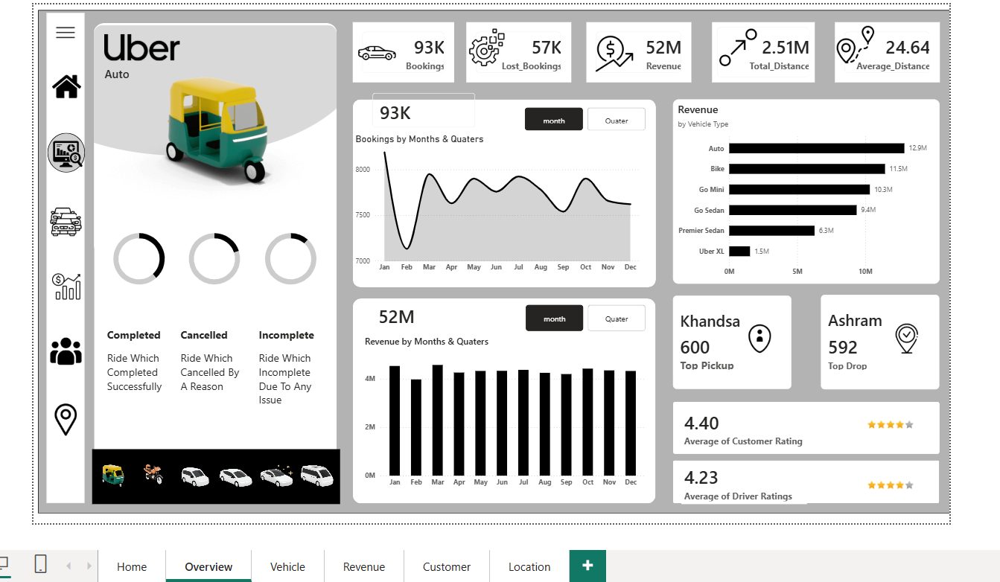
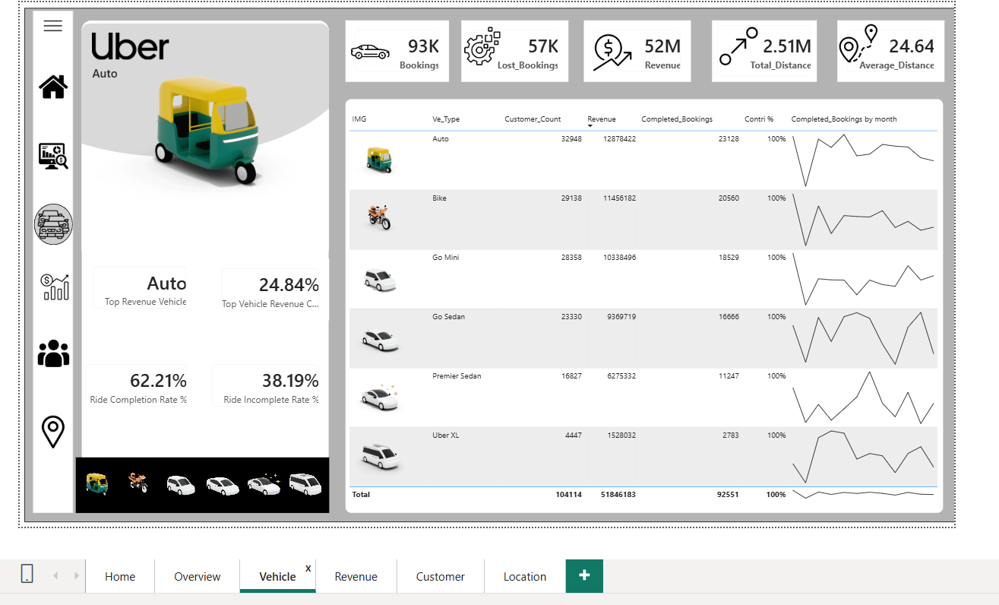
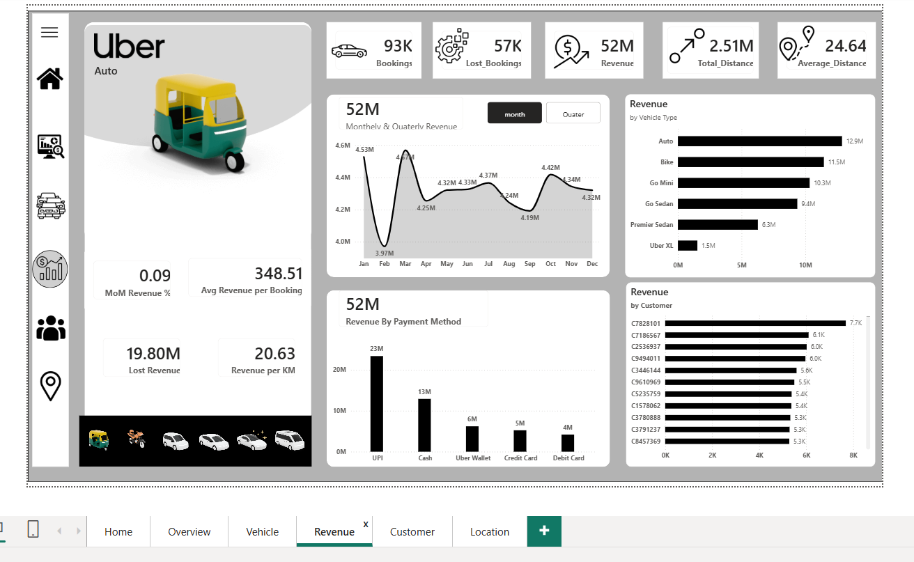
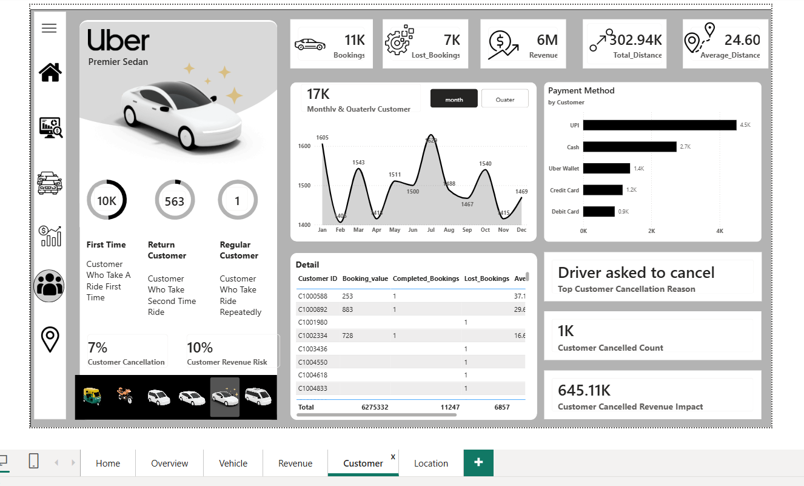
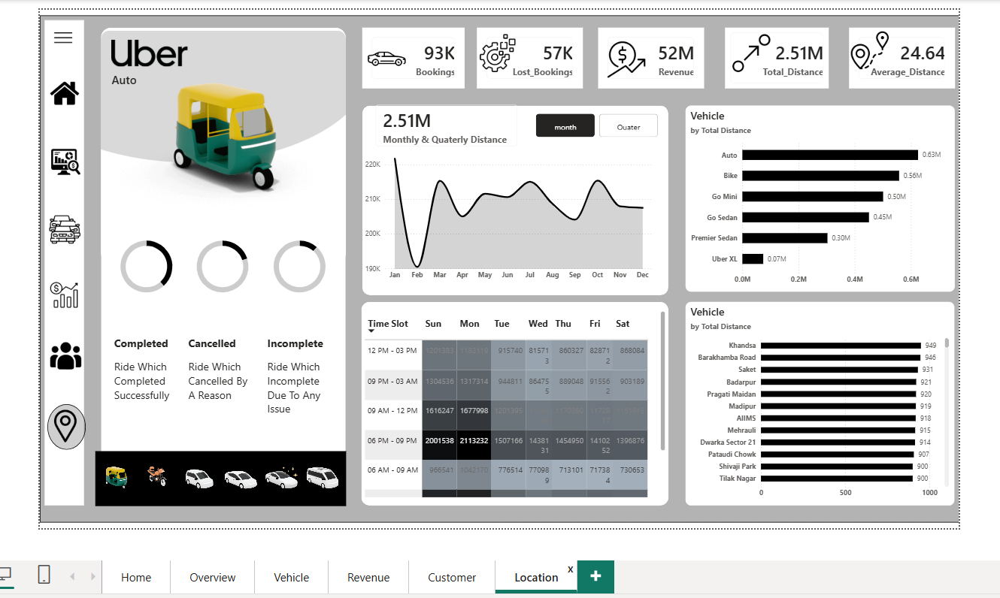

# Uber Ride-Hailing Operational Performance Analysis | Excel | Power BI | DAX

## Executive Snapshot (3-Minute Read)

**Business Question**
Across 93K bookings and $52M in revenue, where is Uber's ride-hailing operation losing value — through cancellations, vehicle-type inefficiency, or customer churn — and which levers would recover the most?

**Key Findings**
- 57K of 93K bookings (~61%) were lost — either cancelled or incomplete — against 52M in realized revenue, meaning a majority of demand isn't converting to completed rides
- Auto is the top-grossing vehicle type ($12.9M, 24.84% of total revenue) but also anchors the widest customer base (32,948 customers) — it's both the volume and revenue leader
- Cancellation rate varies sharply by vehicle type: **Uber XL cancels the most at 66.66%**, while **Bike cancels the least at 57.14%** — premium/low-frequency vehicle types lose more bookings than mass-market ones
- **"Driver asked to cancel"** is the single largest cancellation reason — pointing to a driver-side/dispatch issue rather than a customer-side one
- Lost Revenue from cancellations totals **$19.80M — roughly 38% of gross revenue potential** — with customer cancellations alone costing $645.11K in impact
- UPI dominates payment behavior ($23M of $52M revenue, ~44%), well ahead of Cash ($13M) and card-based methods combined ($9M)
- 10K of ~10.6K Premier Sedan customers are first-time riders vs. just 563 return and 1 regular customer — repeat usage is extremely low in this segment

**Why This Matters**
A $52M revenue number looks healthy in isolation, but with 61% of bookings lost and $19.8M in unrealized revenue, the real story is operational leakage — concentrated in specific vehicle types and driven predominantly by driver-side cancellations, not customer behavior.

**Actionable Recommendations**
- Investigate driver-side cancellation drivers for Uber XL specifically (66.66% cancel rate) — likely a supply/incentive mismatch for that vehicle class
- Address "Driver asked to cancel" as the top cancellation reason with driver-side incentives or penalty review, since it's within Uber's operational control (unlike customer no-shows)
- Build retention flows for Premier Sedan — a 563-repeat-customer base on 10K+ first-time riders signals a conversion problem worth solving before scaling that vehicle tier
- Double down on UPI-first payment flows given its outsized share of revenue, and monitor whether card-based payment friction is suppressing conversion

## 📌 Project Overview

This project analyzes Uber's ride-hailing operations end-to-end — bookings, revenue, cancellations, vehicle-type performance, customer behavior, and location/time patterns. Raw data was cleaned and structured in Excel before being loaded into a multi-page Power BI dashboard built entirely with DAX-driven measures (no external SQL/Python layer; all calculation logic beyond initial cleaning lives in the Power BI data model).

Dashboard pages: **Home** (landing/context) → **Overview** (top-line KPIs) → **Vehicle** (per-vehicle-type performance) → **Revenue** (revenue drivers and payment behavior) → **Customer** (segmentation and cancellation drivers) → **Location** (time-slot and geographic distribution).

## 📊 Executive Summary

### Overview: Bookings, Revenue & Ratings

- Total Bookings: **93K** | Lost Bookings: **57K** | Revenue: **$52M**
- Total Distance: 2.51M | Average Distance per Trip: 24.64
- Average Customer Rating: **4.40** | Average Driver Rating: **4.23**
- Top Pickup Location: Khandsa (600 rides) | Top Drop Location: Ashram (592 rides)
- Revenue by Vehicle Type: Auto ($12.9M) > Bike ($11.5M) > Go Mini ($10.3M) > Go Sedan ($9.4M) > Premier Sedan ($6.3M) > Uber XL ($1.5M)

**Implication:** Auto and Bike together drive nearly half of total revenue ($24.4M of $52M) — the mass-market, lower-fare vehicle types are outperforming premium tiers on total value, not just volume.

### Vehicle-Level Performance

| Vehicle Type | Customers | Revenue | Completed Bookings | Cancellation Rate |
|---|---|---|---|---|
| Auto | 32,948 | $12.88M | 23,128 | — |
| Bike | 29,138 | $11.46M | 20,560 | **57.14% (lowest)** |
| Go Mini | 28,358 | $10.34M | 18,529 | — |
| Go Sedan | 23,330 | $9.37M | 16,666 | — |
| Premier Sedan | 16,827 | $6.28M | 11,247 | — |
| Uber XL | 4,447 | $1.53M | 2,783 | **66.66% (highest)** |
| **Total** | **104,114** | **$51.85M** | **92,551** | — |

**Implication:** Auto is the top revenue vehicle at 24.84% contribution, and completion rates sit around 62% (Ride Completion Rate 62.21%, Incomplete Rate 38.19% for Auto). The gap between Bike's 57.14% and Uber XL's 66.66% cancellation rate suggests vehicle-class-specific dispatch or driver-availability issues rather than a platform-wide problem.

### Revenue & Payment Behavior

- Revenue: **$52M** | MoM Revenue Change: 0.09% | Avg Revenue per Booking: $348.51
- Lost Revenue: **$19.80M** | Revenue per KM: $20.63
- Revenue by Payment Method: UPI ($23M) > Cash ($13M) > Uber Wallet ($6M) > Credit Card ($5M) > Debit Card ($4M)

**Implication:** UPI alone accounts for ~44% of revenue, nearly double Cash — digital-first payment adoption is strong, but ~25% of revenue still moves through Cash, worth factoring into any cashless-push strategy.

### Customer Behavior & Cancellations

- Top Cancellation Reason (platform-wide): **"Driver asked to cancel"**
- Customer Cancellation Rate: 7% | Customer Revenue Risk: 10%
- Customer Cancelled Count: 1K | Customer Cancelled Revenue Impact: **$645.11K**
- Customer segmentation (Premier Sedan example): 10K First-Time customers vs. 563 Return and just 1 Regular customer

**Implication:** With the top cancellation driver being the *driver*, not the customer, this is a supply-side/dispatch problem — solvable through driver incentives or better matching, rather than a demand or pricing issue.

### Location & Time Patterns

- Vehicle-wise distance covered: Auto (0.63M) > Bike (0.56M) > Go Mini (0.50M) > Go Sedan (0.45M) > Premier Sedan (0.30M) > Uber XL (0.07M)
- Top locations by ride volume: Khandsa, Barakhamba Road, Saket, Badarpur, Pragati Maidan, Madipur, AIIMS, Mehrauli, Dwarka Sector 21, Patuadi Chowk — all clustered tightly between 900-949 rides
- Time-slot heatmap (by day × hour) shows the **06 PM – 09 PM** window on **Sunday and Monday** as the clear peak booking window across the week

**Implication:** Demand is geographically distributed rather than concentrated in 1-2 hotspots — the top 10 locations are all within a ~5% range of each other — but time-of-day concentration in the evening peak is sharp and worth capacity planning around.

## Data Model & Preparation

- Raw booking data was cleaned in Excel first — handling blanks/inconsistent entries, standardizing vehicle-type and cancellation-reason labels, and formatting date fields — before being loaded into Power BI

Built as a star schema in Power BI rather than a flat table:

- **Uber** (fact table) — Booking ID, Booking Status, Booking Value, Customer ID, Customer Rating, Date, Driver Cancellation Reason, Cancelled Rides by Customer, Cancelled Rides by Driver
- **Calendar** (date dimension) — Date, Month, Month No, Month Index, Quarter, Quarter Index, Weekday, Weekday Index — related 1-to-many to the fact table for time intelligence
- **IMG** (vehicle dimension) — Vehicle Type, image reference — related 1-to-many to the fact table, drives the per-vehicle-type filtering across all pages
- **Cancel Rides** and **Date Axis** — supporting tables for cancellation breakdowns and continuous date-axis visuals

All KPIs are calculated via a dedicated **measures** table (30+ DAX measures) rather than pre-aggregated source data — including:

- **Volume/Revenue:** Booking_Count, Booking_value, Completed_Bookings, Lost_Bookings, Bookings_Remove_Status_Filter, Avg Revenue per Booking, Avg Revenue per Completed Booking, Revenue per KM
- **Rate/Ratio measures:** Completion Rate %, Lost Revenue %, MoM Revenue %, Contri %, Customer Cancellation Rate, Customer Revenue Risk %, Top Vehicle Revenue Contribution %
- **Customer segmentation:** First_Time, Return_Time, Regular_Customer, Customer_Count, Customer Reliability Index, Customer Cancelled Count, Customer Cancelled Revenue Impact
- **Diagnostic/ranking measures:** Top Customer Cancellation Reason, Top Revenue Vehicle, Lost Revenue, Average_Distance, Total_Distance

Interactive filtering by vehicle type across all pages via a synced slicer/bookmark navigation panel.

## 🛠️ Tools Used

- **Excel** — raw data cleaning and structuring prior to Power BI import
- **Power BI** — star-schema data modeling, multi-page interactive dashboard, drill-through and cross-filtering
- **DAX** — 30+ custom measures spanning revenue/volume aggregation, rate calculations (completion, cancellation, MoM growth), customer segmentation (first-time/return/regular), and diagnostic measures like Customer Reliability Index and Top Customer Cancellation Reason

## Appendix

Dashboard pages: Home, Overview, Vehicle, Revenue, Customer, Location — each filterable by vehicle type via a shared navigation slicer.

---

*This project was developed as part of a data analytics portfolio demonstrating Power BI dashboarding, DAX measure design, and operational/revenue analysis for a ride-hailing business.*
